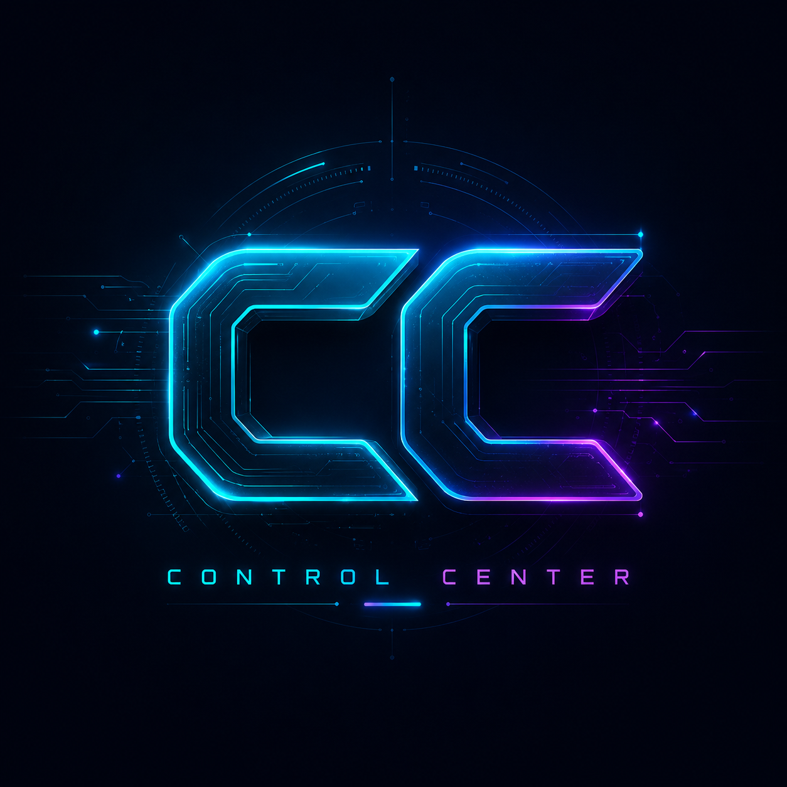
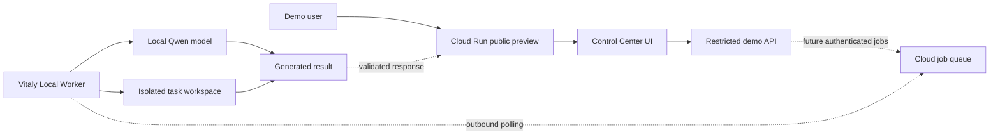

<div align="center">

# AI WORKSPACE CONTROL CENTER

### **A local-first command center for AI tools, project workflows, and controlled execution.**

[](#project-status)
[](#technology)
[](#live-demo)
[](#architecture)
[](#safety-boundaries)

**One interface. Multiple tools. Explicit control.**

[](https://ai-workspace-control-center-745947699440.europe-west1.run.app) ·
[VIEW ARCHITECTURE](#architecture) ·
[PROJECT ROADMAP](#roadmap)

</div>

---

<div align="center">
  
</div>

---

## What this is

AI Workspace Control Center is the public demonstration layer of a larger private local-first development workspace.

It provides a visual command center for:

- discovering registered AI tools and local applications;
- opening focused workspaces such as Fullstack Designer;
- planning projects through an AI-assisted chat interface;
- inspecting local-model availability;
- reviewing workflow and execution status;
- keeping sensitive execution behind explicit confirmation boundaries.

This repository intentionally contains a **curated public preview**, not the entire private workspace.

> The goal is to demonstrate the product, architecture, interaction model, and engineering decisions without publishing private project data, local machine configuration, or unrestricted execution capabilities.

---

## Live demo

**Public demo:**  
[https://ai-workspace-control-center-745947699440.europe-west1.run.app](https://ai-workspace-control-center-745947699440.europe-west1.run.app)

The current public deployment is intentionally restricted.

### Available in the public preview

- Control Center interface
- AI Chat workspace shell
- Fullstack Designer launcher
- Local-model status indicators
- Safe demo API responses
- Cloud-hosted static preview

### Intentionally unavailable

- access to Vitaly's local filesystem;
- arbitrary shell execution;
- private projects and conversations;
- unrestricted package installation;
- destructive workflows;
- direct access to the local LLM;
- unbounded AI generation.

Live generation will be connected later through a separate authenticated Local Worker.

---

## Product idea

Most AI development tools hide orchestration behind one chat window.

Control Center takes a different approach:

```text
SEE THE AVAILABLE TOOLS
        ↓
CHOOSE A FOCUSED WORKSPACE
        ↓
REVIEW CONTEXT AND STATUS
        ↓
PROPOSE AN ACTION
        ↓
CONFIRM BEFORE EXECUTION
```

The interface is designed around visible state, bounded tools, and controlled actions—not invisible autonomy.

---

## Architecture



### Public deployment

```text
GitHub main
    ↓
Cloud Build
    ↓
Docker image
    ↓
Google Cloud Run
    ↓
Public HTTPS demo
```

### Planned hybrid execution

```text
Small focused task
      ↓
Task-size gate
      ↓
Local Worker online?
   ┌──┴──┐
  yes    no
   ↓      ↓
Qwen   restricted cloud fallback
   └──┬──┘
      ↓
validated result
```

---

## Current interface modules

| Module | Purpose | Public status |
|---|---|---|
| AI Chat | Project planning and controlled action proposals | Interface preview |
| Fullstack Designer | Focused project-design workspace | Launcher preview |
| App Registry | Discover tools registered in the workspace | Restricted preview |
| Runtime Status | Show local applications and model availability | Demo state |
| Workflow Layer | Coordinate bounded multi-step actions | Private implementation |
| Local LLM Gateway | Route tasks to a local model | Not connected publicly |

---

## Safety boundaries

The public preview is deliberately separated from the private workspace.

It does not expose:

- local directories;
- environment secrets;
- private model configuration;
- personal project history;
- system commands;
- unrestricted code execution;
- host-machine network access.

Future live tasks will use:

- GitHub authentication;
- per-user daily quotas;
- maximum task size;
- strict timeout;
- isolated temporary workspaces;
- explicit task categories;
- no autonomous retries;
- no execution outside approved paths.

---

## Demo task policy

The planned live demo is designed for small, focused tasks.

### Good demo requests

- Create one architecture diagram
- Generate one technical document
- Build one isolated UI component
- Define one API contract
- Fix one issue in a small supplied file set
- Produce a small project scaffold

### Requests rejected by design

- Build a complete production SaaS
- Refactor an entire repository
- Deploy arbitrary external infrastructure
- Run unrestricted shell commands
- Install unknown packages
- Access private local files

Large requests will be returned with a prompt to reduce the scope.

---

## Technology

| Area | Technology |
|---|---|
| Runtime | Node.js 22 |
| Server | Native Node.js HTTP server |
| Frontend | HTML, CSS, JavaScript |
| Container | Docker |
| Hosting | Google Cloud Run |
| Delivery | GitHub → Cloud Build → Cloud Run |
| Planned local inference | Qwen through a Local Worker |
| Planned identity | GitHub OAuth |
| Planned quota storage | Firestore |

---

## Repository structure

```text
ai-workspace-control-center/
├── public/
│   ├── index.html
│   ├── styles.css
│   └── app.js
├── docs/
│   └── assets/
│       └── control-center-preview.png
├── Dockerfile
├── .dockerignore
├── package.json
├── server.js
└── README.md
```

---

## Run locally

Requirements:

- Node.js 22+

```bash
git clone https://github.com/VitalyRuso/ai-workspace-control-center.git
cd ai-workspace-control-center
npm start
```

Open:

```text
http://localhost:8080
```

To use another port:

```bash
PORT=3000 npm start
```

PowerShell:

```powershell
$env:PORT=3000
npm start
```

---

## Project status

**Current stage:** public interface preview.

The visual Control Center is deployed as a safe standalone demonstration. The private workspace, workflow executor, local project files, and local-model bridge are intentionally excluded.

---

## Roadmap

- [x] Extract a safe public Control Center preview
- [x] Create a standalone Docker deployment
- [x] Publish the repository
- [ ] Deploy the public preview to Cloud Run
- [ ] Add the final live-demo URL
- [ ] Add GitHub authentication
- [ ] Add per-user daily generation quotas
- [ ] Connect Vitaly Local Worker
- [ ] Route focused tasks to local Qwen
- [ ] Add bounded cloud fallback
- [ ] Add a public project-gallery mode

---

## What this project demonstrates

- Local-first AI product architecture
- Separation between interface, orchestration, and execution
- Controlled exposure of a private development environment
- Human-in-the-loop interaction design
- Safe public-demo extraction
- Containerized deployment
- Cloud Run delivery
- Planning for local and cloud model routing
- Product thinking around quotas, scope, privacy, and cost

---

## Public preview strategy

This repository is intentionally not a monorepo dump.

The public GitHub portfolio uses two forms of publication:

1. **Full technical repositories** for projects where source-level review is useful.
2. **Curated demo repositories** for larger private systems where only one safe, representative slice should be public.

A portfolio still needs at least one or two substantial source repositories. Demo-only repositories should complement real code examples, not replace all of them.

---

## Author

Built by **Vitaly**  
GitHub: [@VitalyRuso](https://github.com/VitalyRuso)

Interests:

- AI developer tools
- local-first systems
- browser automation
- human-in-the-loop agents
- project-generation workflows
- practical full-stack engineering

---

<details>
<summary><strong>Control Center principle</strong></summary>

<br>

```text
No giant monorepo dump.
No fake autonomy.
No invisible execution.

Show the system.
Bound the task.
Confirm the action.
```

</details>
