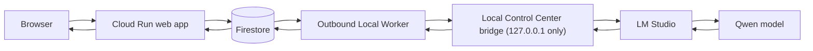

# AI Workspace Control Center

AI Workspace Control Center is a public portfolio demo for a local-first AI chat system. It combines a Cloud Run web application, GitHub OAuth, Firestore-backed persistence, asynchronous job processing, and an outbound-only Local Worker that relays model requests to a localhost-only Local Control Center bridge.

## Live Demo

Public Demo: [https://ai-workspace-control-center-745947699440.europe-west1.run.app](https://ai-workspace-control-center-745947699440.europe-west1.run.app)

## Screenshots

Verified screenshots live in [docs/screenshots](docs/screenshots/).

- Logged-out single-shell UI: `docs/screenshots/logged-out-shell.png`
- Additional authenticated captures: see [docs/screenshots/README.md](docs/screenshots/README.md)

## Key Features

- Public cloud chat interface served from Cloud Run
- GitHub OAuth sign-in with account-scoped chat ownership
- Firestore persistence for users, chats, jobs, usage, and worker status
- Asynchronous job acceptance with HTTP `202`
- Outbound-only Local Worker polling for work instead of accepting inbound connections
- Localhost-only Local Control Center bridge for private model execution
- `MODEL_BACKEND=control-center` routing through the private bridge
- Optional diagnostic fallback to LM Studio's OpenAI-compatible endpoint
- Strict separation between the public demo and private local tools
- Idempotent first-message submission and durable chat recovery after refresh

## System Architecture



The public service exposes a constrained chat interface only. Cloud Run never receives direct filesystem, shell, repository, or private-tool access from the local machine. The Local Worker initiates outbound HTTPS requests to Cloud Run, claims a queued job, forwards a `model.generate` request to the Local Control Center bridge, and reports the result back through Firestore-backed job state.

See [docs/ARCHITECTURE.md](docs/ARCHITECTURE.md) for the full component, OAuth, worker-lease, and error-handling documentation.

## Request Lifecycle

```text
Browser
  -> Cloud Run
  -> Firestore job queue
  -> outbound Local Worker
  -> localhost Local Control Center
  -> LM Studio
  -> Qwen
  -> result returned through the same path
```

Operationally:

1. A signed-in GitHub user opens the Control Center shell.
2. The first accepted message creates a persistent chat and a queued job.
3. The API returns HTTP `202` immediately instead of waiting for model output.
4. The Local Worker polls Cloud Run, claims the job with a lease, and forwards a bounded request to the Local Control Center bridge.
5. The bridge invokes the private model runtime and returns a response.
6. The Local Worker reports completion or failure back to Cloud Run.
7. The browser polls the job and renders the assistant response inside the same shell.

## Security Model

- Cloud Run cannot establish an inbound connection to the local machine.
- The Local Worker initiates outbound polling and completion events.
- The Local Control Center bridge binds only to `127.0.0.1`.
- The public demo exposes `model.generate` only.
- Project, filesystem, shell, package-management, and private local tool access remain disabled for public users.
- GitHub users can read only their own chats, jobs, and usage state.
- Worker and bridge authentication use separate bearer tokens.

See [docs/SECURITY.md](docs/SECURITY.md) for the full trust-boundary and disclosure guidance.

## Technology Stack

- Node.js 22
- Cloud Run
- Firestore
- GitHub OAuth
- Local Worker in Node.js
- Local Control Center bridge on `127.0.0.1`
- LM Studio
- Qwen

## Repository Structure

```text
public/              Browser UI shell and client state logic
src/                 OAuth helpers and persistence store implementations
worker/              Outbound Local Worker implementation and local operator notes
test/                Node test suite covering workflow, safety, and documentation checks
docs/                Architecture, security, screenshots, and portfolio support material
server.js            Cloud Run HTTP entrypoint
```

## Local Development

Prerequisites:

- Node.js 22+
- A Firestore project with Application Default Credentials when using the live persistence backend

Install and run:

```bash
npm ci
npm test
npm start
```

The local server serves the same Control Center shell used in the deployed demo. For screenshots or isolated development, the test suite also exercises the app against an in-memory store.

## Environment Variables

Use placeholders only in tracked configuration files:

```dotenv
WORKER_TOKEN=<worker-token>
GITHUB_CLIENT_ID=<github-client-id>
GITHUB_CLIENT_SECRET=<github-client-secret>
SESSION_SECRET=<session-secret>
PUBLIC_BASE_URL=<cloud-run-url>
GOOGLE_CLOUD_PROJECT=<google-cloud-project-id>
WORKER_ID=<worker-id>
LOCAL_CONTROL_CENTER_URL=http://127.0.0.1:3478
LOCAL_CONTROL_CENTER_TOKEN=<local-bridge-token>
MODEL_BACKEND=control-center
LM_URL=http://127.0.0.1:1234/v1
```

Real credentials, worker secret files, PID files, worker state, and runtime logs must stay outside Git.

## Tests

Run:

```bash
npm test
```

The suite currently verifies:

- persistent logged-out and logged-in shell behavior
- automatic first-message chat creation
- HTTP `202` acceptance
- draft preservation on failure
- duplicate-send idempotency
- Firestore ownership isolation
- public permission restrictions
- Control Center backend selection
- bridge offline and response-mapping behavior
- tracked-secret exclusions
- public-documentation privacy rules

## Deployment Overview

The repository is deployed as a Docker-based Cloud Run service backed by Firestore. Cloud Run handles the public shell, OAuth callback, account-scoped chat APIs, and worker polling endpoints. The Local Worker is operated separately and must be configured with the worker token and the localhost bridge token.

## Current Limitations

- The public demo intentionally exposes a narrow chat surface only.
- The Local Worker and Local Control Center remain private local runtime components.
- The public service does not expose repository tools, shell access, or project automation features.
- Daily generation quota is intentionally small.
- The live demo depends on a healthy local runtime and model availability.
- The screenshot set is still missing authenticated captures that require a safe demo session.

## Roadmap

- Add verified authenticated screenshots for empty-state, active-chat, and local-runtime panels
- Add a short demo video focused on the public/private boundary
- Expand health reporting around the Local Control Center bridge
- Add smoke checks for deployment readiness and status wording

## License Notice

This repository is publicly visible for evaluation and portfolio review only. See [LICENSE](LICENSE).
