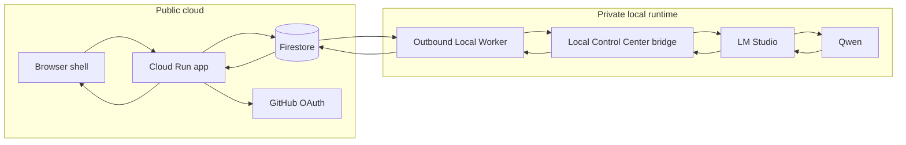
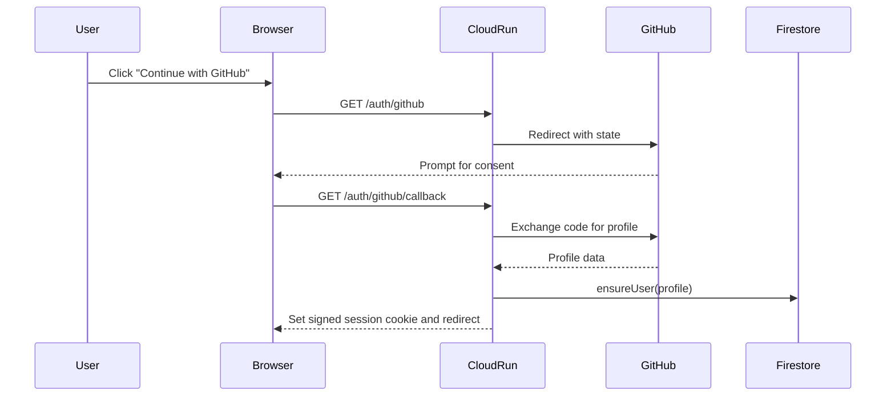
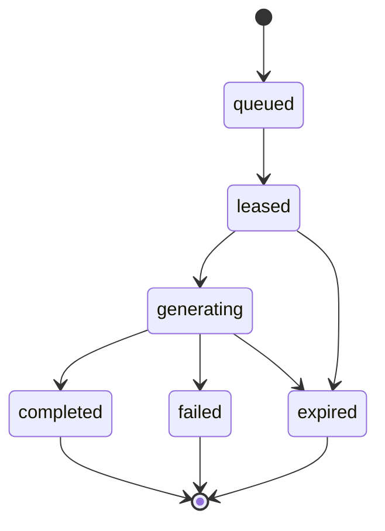

# Architecture

AI Workspace Control Center is split into public cloud components and private local runtime components. The design goal is to demonstrate a working AI chat product boundary without exposing the project owner's private workstation, filesystem, or internal tools.

## Topology



## Cloud Components

- `server.js`
  Handles static asset delivery, GitHub OAuth, chat APIs, job APIs, worker heartbeat, and worker polling.
- Firestore
  Stores users, chats, messages, daily usage, worker status, jobs, and idempotency keys.
- Cloud Run
  Hosts the public shell and public API. It never initiates a connection into the local machine.

## Local Components

- `worker/worker.js`
  Polls for work, reports runtime status, forwards bounded prompts, and returns completion or failure.
- Local Control Center bridge
  Binds to `127.0.0.1` and accepts only authenticated local requests.
- LM Studio
  Hosts the local model runtime.
- Qwen
  Provides the model response shown in the public demo.

## OAuth Flow



The public shell uses the GitHub profile only for account identity and ownership isolation. The service discards the GitHub access token after profile retrieval.

## Job Lifecycle



### Acceptance path

1. The browser submits a message.
2. The API validates the session, origin, quota, and current worker status.
3. The store creates a chat if needed, stores the user message, creates a queued job, and records the idempotency key.
4. The API returns HTTP `202`.

### Completion path

1. The Local Worker polls and claims the next available job.
2. The store transitions the job to `leased` with a lease deadline.
3. The worker marks the job `started`, which moves it to `generating`.
4. The worker sends one bounded `model.generate` request through the private bridge.
5. The worker reports `complete` or `failed`.
6. The browser polls the public job endpoint until completion.

## Worker Lease Lifecycle

- `queued`
  Ready for claim.
- `leased`
  Reserved for one worker. A second poll returns no duplicate claim.
- `generating`
  Work has started and the lease is extended.
- `completed` / `failed`
  Terminal states reported back to the browser.
- `expired`
  Recoverable failure state if a lease ages out before a terminal event.

Lease handling is intentionally idempotent. Repeated completion reports for the same worker/job pair do not duplicate assistant messages.

## Local Control Center Bridge

The Local Control Center bridge is a localhost-only boundary:

- bind address: `127.0.0.1`
- caller: Local Worker only
- permission surface for the public demo: `model.generate`
- excluded from the public demo: repository access, filesystem access, shell access, tool execution, package installation, and project orchestration

## Model Invocation

`MODEL_BACKEND=control-center` is the primary path:

```text
worker -> /api/local-bridge/runs -> LM Studio -> Qwen
```

Diagnostic fallback only:

```text
worker -> LM Studio OpenAI-compatible endpoint
```

The public demo is not presented as a general agent runner. It is a constrained chat demo over a private local model path.

## Error Handling

- Browser requests time out without destroying the draft.
- HTTP `202` separates request acceptance from model completion.
- Worker failures are returned as job failures instead of crashing the shell.
- Offline worker state is surfaced honestly in the UI.
- Bridge failures are mapped to clean public errors.

## Idempotency

The first-message workflow uses an `Idempotency-Key` header. The persistence layer records that key per owner account, which prevents duplicate chats and duplicate jobs when the user retries the same submission.

## Quota Enforcement

Daily quota is enforced per GitHub user and UTC day inside the store layer. The browser renders the remaining count and the API rejects over-limit submissions before any new job is created.
