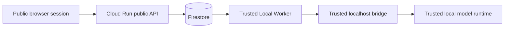

# Security

AI Workspace Control Center is designed to show a public AI demo without turning the project owner's private workstation into a public compute surface.

## Trust Boundary

Public users can interact with the browser shell and account-scoped chat APIs only. They cannot directly reach the Local Worker, the Local Control Center bridge, LM Studio, or any private local tools.

## Public / Private Boundary

### Public side

- browser UI
- GitHub OAuth sign-in
- Cloud Run APIs
- Firestore-backed chat and job state

### Private side

- Local Worker process
- localhost bridge token
- Local Control Center runtime
- LM Studio
- model files and private machine resources

## Worker Token

The Local Worker authenticates to Cloud Run with a dedicated bearer token:

- stored outside Git
- sent only on worker heartbeat, poll, and job event endpoints
- checked before the worker can claim or update a job

This token is separate from any browser session or OAuth credential.

## Localhost Bridge Token

The worker authenticates to the Local Control Center bridge with a different token:

- transmitted only on localhost requests
- never exposed to the browser
- never returned through public APIs

This token protects the private `model.generate` path from accidental local misuse.

## GitHub OAuth

GitHub OAuth provides:

- user identity
- account-scoped chat ownership
- logout back to the same shell

The application uses the GitHub profile for identity and discards the temporary access token after retrieving user metadata.

## Firestore Ownership Isolation

All public chat, message, usage, and job reads are filtered by the signed-in account ID. A user cannot read or mutate another account's conversations or job state.

## No Public Filesystem Access

The public demo does not expose:

- repository browsing
- file reads
- file writes
- uploads into private project directories
- generated private project output

Public users interact only with chat APIs and their own persisted chat history.

## No Arbitrary Shell Execution

The public demo does not expose:

- shell commands
- package installation
- process control
- project automation tools
- Local Control Center internal tools

The Local Worker forwards a constrained `model.generate` request only.

## Browser-Side Protections

- sessions stored in signed cookies
- origin validation for browser mutations
- strict CSP headers
- no third-party script execution
- no inbound local-machine connectivity from Cloud Run

## Responsible Disclosure

If you discover a security issue, do not post exploit details publicly. Report the issue through the repository's issue tracker or another project-controlled disclosure channel that does not require personal email contact. Include:

- affected endpoint or component
- reproduction steps
- expected vs actual behavior
- impact assessment

Do not include live secrets or private user data in the report.
